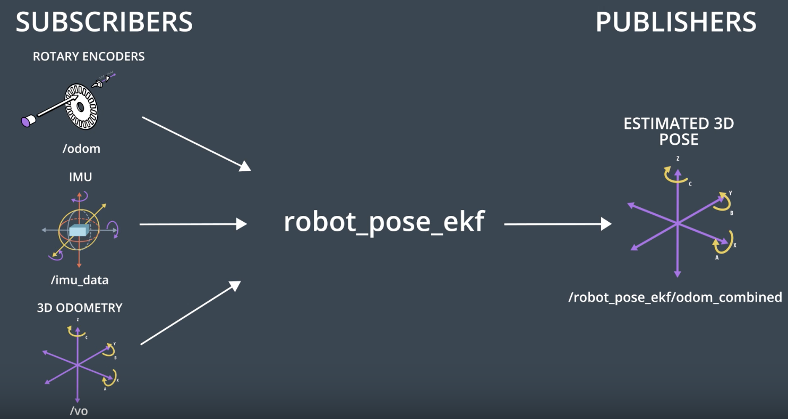

[](https://www.udacity.com/robotics)

# robot_pose_ekf package
The [robot_pose_ekf](http://wiki.ros.org/robot_pose_ekf) ROS package applies sensor fusion on the robot IMU and odometry values to estimate its 3D pose.

### Nodes
The package contains a single node 
1. **robot_pose_ekf**: Implements an Extended Kalman Filter, subscribes to robot measurements, and publishes a filtered 3D pose.
      * Script File: wtf.py
      * Subscriber: "/odom", "/imu_data", and "/vo " 
      * Publisher: "/robot_pose_ekf/odom_combined"



### Steps to launch the nodes
#### Step1: Install the package
```sh
$ cd /home/workspace/catkin_ws/src/
$ git clone https://github.com/udacity/robot_pose_ekf
```
#### Step2: Edit the robot_pose_ekf.launch file
```html
<launch>

<node pkg="robot_pose_ekf" type="robot_pose_ekf" name="robot_pose_ekf">
  <param name="output_frame" value="odom_combined"/>
  <param name="base_footprint_frame" value="base_footprint"/>
  <param name="freq" value="30.0"/>
  <param name="sensor_timeout" value="1.0"/>  
  <param name="odom_used" value="true"/>
  <param name="imu_used" value="true"/>
  <param name="vo_used" value="false"/>

  <remap from="imu_data" to="/mobile_base/sensors/imu_data" />    

</node>

</launch>
```
#### Step3: Build the package
$ cd /home/workspace/catkin_ws
$ catkin_make
$ source devel/setup.bash
#### Step4: Launch the node
$ roslaunch robot_pose_ekf robot_pose_ekf.launch
